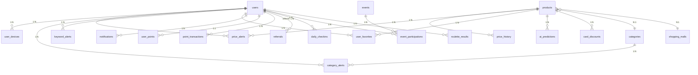

# PullCents DB 스키마 설계

> **상태: DRAFT v0.4**
> 작성일: 2026-03-01 | 갱신: 2026-03-01
> DB: PostgreSQL 17.9 (localhost:5432) | ORM: SQLx (Rust, 컴파일타임 검증)
> MVP 대상: 쿠팡 + 네이버쇼핑
> **주의: 설계 문서입니다. SQL 코드 아님. 아직 구현하지 마.**

---

## 테이블 총괄 (23개)

| 그룹 | 테이블 | 설명 |
|------|--------|------|
| **핵심** | users, user_devices | 사용자 + 디바이스(푸시 토큰) |
| **상품** | products, price_history, shopping_malls, categories | 상품 정보 + 가격 이력 |
| **알림** | price_alerts, category_alerts, keyword_alerts, notifications | 4종 알림 체계 |
| **AI** | ai_predictions | AI 가격 예측 결과 |
| **카드 할인** | card_discounts | 카드사별 할인가 |
| **보상** | user_points, point_transactions, referrals, daily_checkins, roulette_results | 센트(¢) + 추천 + 출석 + 룰렛 |
| **이벤트** | events, event_participations | 이벤트/퀴즈 |
| **보안** | api_access_logs, blocked_ips | 접근 로그 + IP 차단 ★ 신규 |
| **기타** | user_favorites, popular_searches | 즐겨찾기 + 인기 검색어 |

---

## 1. ER 다이어그램

---

## 2. 테이블별 컬럼 설계

### 2-1. users (사용자)

| 컬럼 | 타입 | 제약조건 | 설명 |
|---|---|---|---|
| id | BIGINT | PK, GENERATED ALWAYS AS IDENTITY | |
| email | TEXT | UNIQUE, NOT NULL | 로그인 식별자 |
| nickname | TEXT | | 표시 이름 |
| auth_provider | TEXT | NOT NULL | kakao, google, apple, naver |
| auth_provider_id | TEXT | NOT NULL | 소셜 고유 ID |
| profile_image_url | TEXT | | |
| point_balance | INTEGER | NOT NULL, DEFAULT 0 | 현재 포인트 잔액 (비정규화) |
| referral_code | TEXT | UNIQUE, NOT NULL | 내 추천 코드 (가입 시 자동 생성) |
| referred_by | BIGINT | FK -> users(id) | 나를 추천한 사용자 |
| created_at | TIMESTAMPTZ | NOT NULL, DEFAULT NOW() | |
| updated_at | TIMESTAMPTZ | NOT NULL, DEFAULT NOW() | |
| deleted_at | TIMESTAMPTZ | | soft delete |

**변경점 (v0.1 → v0.2):**
- `point_balance` 추가 — 매 조회마다 point_transactions 합산 불필요
- `referral_code` 추가 — 추천 보상 시스템용 고유 코드
- `referred_by` 추가 — 추천인 추적

### 2-2. user_devices (디바이스/푸시 토큰)

| 컬럼 | 타입 | 제약조건 | 설명 |
|---|---|---|---|
| id | BIGINT | PK, GENERATED ALWAYS AS IDENTITY | |
| user_id | BIGINT | FK -> users(id), NOT NULL | |
| device_token | TEXT | NOT NULL | APNs(iOS) / FCM(Android) 토큰 |
| platform | TEXT | NOT NULL | android, ios, web |
| push_enabled | BOOLEAN | NOT NULL, DEFAULT TRUE | |
| created_at | TIMESTAMPTZ | NOT NULL, DEFAULT NOW() | |
| updated_at | TIMESTAMPTZ | NOT NULL, DEFAULT NOW() | |

### 2-3. products (상품)

| 컬럼 | 타입 | 제약조건 | 설명 |
|---|---|---|---|
| id | BIGINT | PK, GENERATED ALWAYS AS IDENTITY | |
| shopping_mall_id | INTEGER | FK -> shopping_malls(id), NOT NULL | |
| category_id | INTEGER | FK -> categories(id) | |
| external_product_id | TEXT | NOT NULL | 쇼핑몰 내 상품 ID |
| vendor_item_id | TEXT | | 판매자 아이템 ID |
| product_name | TEXT | NOT NULL | |
| product_url | TEXT | | 원본 URL |
| image_url | TEXT | | |
| current_price | INTEGER | | 현재 가격 (원) |
| lowest_price | INTEGER | | 역대 최저가 |
| highest_price | INTEGER | | 역대 최고가 |
| average_price | INTEGER | | 평균가 |
| unit_type | TEXT | | 단가 단위 (1정당, 100ml당 등) |
| unit_price | NUMERIC(12,2) | | 단가 금액 |
| rating | NUMERIC(2,1) | | 별점 |
| review_count | INTEGER | DEFAULT 0 | |
| is_out_of_stock | BOOLEAN | NOT NULL, DEFAULT FALSE | |
| price_trend | TEXT | | rising, falling, stable |
| days_since_lowest | INTEGER | | N일만에 최저가 |
| drop_from_average | INTEGER | | 평균가 대비 하락액 |
| buy_timing_score | SMALLINT | | 구매타이밍 0-100 |
| sales_velocity | NUMERIC(8,2) | | 판매 속도 (일간 판매량 추정) |
| first_tracked_at | TIMESTAMPTZ | | 최초 추적 시작일 |
| price_updated_at | TIMESTAMPTZ | | 가격 최종 갱신 |
| created_at | TIMESTAMPTZ | NOT NULL, DEFAULT NOW() | |
| updated_at | TIMESTAMPTZ | NOT NULL, DEFAULT NOW() | |

**UNIQUE 제약:** `(shopping_mall_id, external_product_id, vendor_item_id)`

**변경점 (v0.1 → v0.2):**
- `sales_velocity` 추가 — 판매 속도 급증 선제 알림용

### 2-4. price_history (가격 변동 이력)

| 컬럼 | 타입 | 제약조건 | 설명 |
|---|---|---|---|
| id | BIGINT | PK, GENERATED ALWAYS AS IDENTITY | |
| product_id | BIGINT | FK -> products(id), NOT NULL | |
| price | INTEGER | NOT NULL | 해당 시점 가격 |
| is_out_of_stock | BOOLEAN | NOT NULL, DEFAULT FALSE | |
| recorded_at | TIMESTAMPTZ | NOT NULL | 기록 시점 |

**보관 정책: 기한 없이 전체 보관** (무기한)
- 장기 가격 그래프, AI 예측 학습 데이터, 요일별/계절별 패턴 분석에 필수
- 파티셔닝으로 성능 관리 (삭제 없이 아카이브만)

### 2-5. ai_predictions (AI 가격 예측) ★ 신규

| 컬럼 | 타입 | 제약조건 | 설명 |
|---|---|---|---|
| id | BIGINT | PK, GENERATED ALWAYS AS IDENTITY | |
| product_id | BIGINT | FK -> products(id), NOT NULL | |
| predicted_action | TEXT | NOT NULL | buy_now, wait, neutral |
| confidence | NUMERIC(3,2) | NOT NULL | 신뢰도 0.00~1.00 |
| predicted_lowest_price | INTEGER | | 예측 최저가 |
| predicted_lowest_date | DATE | | 예측 최저가 도달 예상일 |
| price_at_prediction | INTEGER | NOT NULL | 예측 시점 가격 |
| factors | JSONB | | 예측 근거 (계절성, 프로모션 주기 등) |
| created_at | TIMESTAMPTZ | NOT NULL, DEFAULT NOW() | 예측 생성 시점 |
| expires_at | TIMESTAMPTZ | NOT NULL | 예측 유효기간 |

**설계 근거:**
- Hopper 모델 참고: "지금 사세요 / 기다리세요" 판단 결과 저장
- `factors` JSONB — 예측에 사용된 근거를 유연하게 저장 (계절성 점수, 프로모션 주기, 가격 이력 패턴 등)
- `expires_at` — 예측은 시간이 지나면 무효. 최신 예측만 활성 사용
- 모든 사용자에게 무료 제공

### 2-6. card_discounts (카드 할인가) ★ 신규

| 컬럼 | 타입 | 제약조건 | 설명 |
|---|---|---|---|
| id | BIGINT | PK, GENERATED ALWAYS AS IDENTITY | |
| product_id | BIGINT | FK -> products(id), NOT NULL | |
| card_name | TEXT | NOT NULL | 카드사 이름 (KB국민, 신한, 삼성 등) |
| card_type | TEXT | NOT NULL | 카드 종류 (credit, check, membership) |
| discount_type | TEXT | NOT NULL | percent, fixed_amount |
| discount_value | INTEGER | NOT NULL | 할인율(%) 또는 할인금액(원) |
| discounted_price | INTEGER | | 할인 적용 후 가격 |
| min_purchase | INTEGER | | 최소 결제 금액 조건 |
| valid_from | DATE | | 할인 시작일 |
| valid_until | DATE | | 할인 종료일 |
| is_active | BOOLEAN | NOT NULL, DEFAULT TRUE | |
| created_at | TIMESTAMPTZ | NOT NULL, DEFAULT NOW() | |
| updated_at | TIMESTAMPTZ | NOT NULL, DEFAULT NOW() | |

**설계 근거:**
- 폴센트의 "카드 할인가 적용" 기능 — 경쟁사 중 폴센트만 유일하게 제공
- 카드사별 즉시할인/할인율을 저장하여 사용자에게 실질 최저가 안내
- `valid_from/until`로 기간 한정 할인 관리

### 2-7. price_alerts (가격 알림 설정)

v0.1과 동일. 4단계: target_price, below_average, near_lowest, all_time_low

### 2-8. category_alerts (카테고리 패시브 알림) ★ 신규

| 컬럼 | 타입 | 제약조건 | 설명 |
|---|---|---|---|
| id | BIGINT | PK, GENERATED ALWAYS AS IDENTITY | |
| user_id | BIGINT | FK -> users(id), NOT NULL | |
| category_id | INTEGER | FK -> categories(id), NOT NULL | 모니터링 카테고리 |
| alert_condition | TEXT | NOT NULL | 알림 조건 (아래 참고) |
| threshold_percent | INTEGER | | % 기반 조건 시 임계값 |
| max_price | INTEGER | | 최대 가격 필터 |
| is_active | BOOLEAN | NOT NULL, DEFAULT TRUE | |
| created_at | TIMESTAMPTZ | NOT NULL, DEFAULT NOW() | |
| updated_at | TIMESTAMPTZ | NOT NULL, DEFAULT NOW() | |

**alert_condition 값:**

| 값 | 설명 |
|---|---|
| `price_drop_percent` | 카테고리 내 상품이 N% 이상 하락 시 |
| `all_time_low` | 카테고리 내 역대 최저가 갱신 상품 발견 시 |
| `buy_timing` | 구매타이밍 점수가 높은 상품 발견 시 |
| `sales_spike` | 판매 속도 급증 상품 감지 시 |

**설계 근거:**
- **핵심 차별점**: 사용자가 카테고리만 등록하면 자동 모니터링 (패시브 알림)
- 개별 상품 즐겨찾기 불필요 — "Set it and forget it"
- `threshold_percent`로 민감도 조절 ("5% 이상 하락 시만 알림")
- `max_price`로 예산 범위 필터

### 2-9. keyword_alerts (키워드 핫딜 추적)

v0.1과 동일. keyword + category_id(선택) + max_price(선택)

### 2-10. notifications (알림 발송 이력)

| 컬럼 | 타입 | 제약조건 | 설명 |
|---|---|---|---|
| id | BIGINT | PK, GENERATED ALWAYS AS IDENTITY | |
| user_id | BIGINT | FK -> users(id), NOT NULL | |
| notification_type | TEXT | NOT NULL | price_alert, category_alert, keyword_alert, referral, event, system |
| reference_id | BIGINT | | 관련 엔티티 ID (알림/이벤트 등) |
| reference_type | TEXT | | 관련 엔티티 타입 |
| title | TEXT | NOT NULL | |
| body | TEXT | | |
| deep_link | TEXT | | 앱 내 이동 경로 |
| is_read | BOOLEAN | NOT NULL, DEFAULT FALSE | |
| sent_at | TIMESTAMPTZ | NOT NULL, DEFAULT NOW() | |
| read_at | TIMESTAMPTZ | | |

**변경점 (v0.1 → v0.2):**
- `price_alert_id` + `keyword_alert_id` → `reference_id` + `reference_type` 통합 (다형성 참조)
- `notification_type`에 referral, event 추가

### 2-11. user_points (사용자 센트 잔액) ★ 신규

| 컬럼 | 타입 | 제약조건 | 설명 |
|---|---|---|---|
| id | BIGINT | PK, GENERATED ALWAYS AS IDENTITY | |
| user_id | BIGINT | FK -> users(id), UNIQUE, NOT NULL | 1:1 관계 |
| balance | INTEGER | NOT NULL, DEFAULT 0 | 현재 잔액 |
| total_earned | INTEGER | NOT NULL, DEFAULT 0 | 누적 획득 |
| total_spent | INTEGER | NOT NULL, DEFAULT 0 | 누적 사용 |
| updated_at | TIMESTAMPTZ | NOT NULL, DEFAULT NOW() | |

**설계 근거:**
- PullCents "센트(¢)" 보상 화폐 — 기프티콘 교환 가능한 실질 가치
- `balance`는 `users.point_balance`와 동기화 (이중 캐시로 빠른 조회)
- 센트 획득/사용은 모두 point_transactions에 기록

### 2-12. point_transactions (포인트 거래 이력) ★ 신규

| 컬럼 | 타입 | 제약조건 | 설명 |
|---|---|---|---|
| id | BIGINT | PK, GENERATED ALWAYS AS IDENTITY | |
| user_id | BIGINT | FK -> users(id), NOT NULL | |
| amount | INTEGER | NOT NULL | 양수=획득, 음수=사용 |
| transaction_type | TEXT | NOT NULL | 거래 유형 (아래 참고) |
| reference_id | BIGINT | | 관련 엔티티 ID |
| reference_type | TEXT | | 관련 엔티티 타입 |
| description | TEXT | | 설명 ("출석체크 보상", "추천인 보상" 등) |
| created_at | TIMESTAMPTZ | NOT NULL, DEFAULT NOW() | |

**transaction_type 값:**

| 값 | amount | 설명 |
|---|---|---|
| `roulette_checkin` | +N | 출석 10일 룰렛 당첨 보상 |
| `roulette_event` | +N | 이벤트/퀴즈 룰렛 당첨 보상 |
| `referral_reward` | +N | 추천 보상 (추천인 3¢ 확정) |
| `referral_welcome` | +N | 피추천인 웰컴 보상 (1¢) |
| `signup_bonus` | +N | 가입 보너스 |
| `gifticon_exchange` | -N | 기프티콘 교환에 사용 |
| `ad_removal` | -N | 광고 제거에 사용 |
| `admin_adjustment` | ±N | 운영자 수동 조정 |

### 2-13. referrals (추천 보상 추적) ★ 신규

| 컬럼 | 타입 | 제약조건 | 설명 |
|---|---|---|---|
| id | BIGINT | PK, GENERATED ALWAYS AS IDENTITY | |
| referrer_id | BIGINT | FK -> users(id), NOT NULL | 추천한 사용자 |
| referred_id | BIGINT | FK -> users(id), UNIQUE, NOT NULL | 추천받아 가입한 사용자 |
| referral_code | TEXT | NOT NULL | 사용된 추천 코드 |
| referrer_rewarded | BOOLEAN | NOT NULL, DEFAULT FALSE | 추천인 보상 지급 여부 |
| referred_rewarded | BOOLEAN | NOT NULL, DEFAULT FALSE | 피추천인 보상 지급 여부 |
| created_at | TIMESTAMPTZ | NOT NULL, DEFAULT NOW() | |

**설계 근거:**
- `referred_id` UNIQUE — 한 사용자는 한 번만 추천받을 수 있음
- 보상 지급 여부를 별도 플래그로 관리 — 조건부 보상 (가입 후 N일 활동 시 지급 등)

### 2-14. daily_checkins (출석체크) ★ 신규

| 컬럼 | 타입 | 제약조건 | 설명 |
|---|---|---|---|
| id | BIGINT | PK, GENERATED ALWAYS AS IDENTITY | |
| user_id | BIGINT | FK -> users(id), NOT NULL | |
| checkin_date | DATE | NOT NULL | 출석 날짜 |
| streak_count | INTEGER | NOT NULL, DEFAULT 1 | 연속 출석 일수 |
| roulette_earned | BOOLEAN | NOT NULL, DEFAULT FALSE | 10일 달성으로 룰렛 기회 획득 여부 |
| created_at | TIMESTAMPTZ | NOT NULL, DEFAULT NOW() | |

**UNIQUE 제약:** `(user_id, checkin_date)` — 하루 1회만

**설계 근거:**
- `streak_count` — 10일 연속 출석 시 룰렛 기회 획득
- 연속 출석 끊기면 streak_count 리셋
- 월 최대 3회 룰렛 기회 (10일×3 = 30일)

### 2-15. events (이벤트/퀴즈) ★ 신규

| 컬럼 | 타입 | 제약조건 | 설명 |
|---|---|---|---|
| id | BIGINT | PK, GENERATED ALWAYS AS IDENTITY | |
| title | TEXT | NOT NULL | 이벤트 제목 |
| description | TEXT | | 설명 |
| event_type | TEXT | NOT NULL | quiz, roulette, survey, promotion |
| reward_points | INTEGER | NOT NULL, DEFAULT 0 | 참여 보상 포인트 |
| max_participants | INTEGER | | 최대 참여자 (NULL = 무제한) |
| quiz_data | JSONB | | 퀴즈 문제/정답 데이터 |
| starts_at | TIMESTAMPTZ | NOT NULL | 시작일시 |
| ends_at | TIMESTAMPTZ | NOT NULL | 종료일시 |
| is_active | BOOLEAN | NOT NULL, DEFAULT TRUE | |
| created_at | TIMESTAMPTZ | NOT NULL, DEFAULT NOW() | |

### 2-16. event_participations (이벤트 참여 이력) ★ 신규

| 컬럼 | 타입 | 제약조건 | 설명 |
|---|---|---|---|
| id | BIGINT | PK, GENERATED ALWAYS AS IDENTITY | |
| event_id | BIGINT | FK -> events(id), NOT NULL | |
| user_id | BIGINT | FK -> users(id), NOT NULL | |
| answer | JSONB | | 퀴즈 답변 등 |
| is_correct | BOOLEAN | | 퀴즈 정답 여부 |
| points_earned | INTEGER | NOT NULL, DEFAULT 0 | 획득 포인트 |
| created_at | TIMESTAMPTZ | NOT NULL, DEFAULT NOW() | |

**UNIQUE 제약:** `(event_id, user_id)` — 이벤트당 1회 참여

### 2-17. roulette_results (룰렛 결과) ★ 신규

| 컬럼 | 타입 | 제약조건 | 설명 |
|---|---|---|---|
| id | BIGINT | PK, GENERATED ALWAYS AS IDENTITY | |
| user_id | BIGINT | FK -> users(id), NOT NULL | |
| roulette_type | TEXT | NOT NULL | checkin, event, quiz |
| reference_id | BIGINT | | 관련 엔티티 ID (daily_checkin_id 또는 event_participation_id) |
| is_winner | BOOLEAN | NOT NULL | 당첨 여부 |
| reward_amount | INTEGER | NOT NULL, DEFAULT 0 | 당첨 센트(¢) (0=미당첨, 1~2=당첨) |
| created_at | TIMESTAMPTZ | NOT NULL, DEFAULT NOW() | |

**설계 근거:**
- 출석체크/이벤트/퀴즈 모두 확률형 룰렛으로 보상 → 통합 기록 테이블
- `roulette_type`으로 출석 룰렛/이벤트 룰렛 구분
- 당첨 시 자동으로 point_transactions에 적립 기록 생성

### 2-18. popular_searches (인기 검색어) ★ 신규

| 컬럼 | 타입 | 제약조건 | 설명 |
|---|---|---|---|
| id | INTEGER | PK, GENERATED ALWAYS AS IDENTITY | |
| keyword | TEXT | NOT NULL | 검색어 |
| search_count | INTEGER | NOT NULL, DEFAULT 0 | 검색 횟수 (집계 기간 내) |
| rank | SMALLINT | NOT NULL | 순위 (1~20) |
| trend | TEXT | | up, down, new, stable |
| updated_at | TIMESTAMPTZ | NOT NULL, DEFAULT NOW() | 집계 갱신 시점 |

**설계 근거:**
- 지니알림의 인기 검색어 태그 참고
- 앱 메인 화면에서 스크롤링으로 표시
- 실시간 검색 로그에서 주기적으로 집계하여 이 테이블 갱신
- `trend` — 순위 변동 방향 (↑↓ 화살표 표시용)

### 2-19. api_access_logs (API 접근 로그) ★ 신규

| 컬럼 | 타입 | 제약조건 | 설명 |
|---|---|---|---|
| id | BIGINT | PK, GENERATED ALWAYS AS IDENTITY | |
| ip_address | INET | NOT NULL | 요청 IP |
| user_id | BIGINT | FK -> users(id) | 인증 사용자 (NULL=비인증) |
| endpoint | TEXT | NOT NULL | 요청 경로 (예: /api/products/123) |
| method | TEXT | NOT NULL | GET, POST 등 |
| status_code | SMALLINT | NOT NULL | HTTP 응답 코드 |
| user_agent | TEXT | | User-Agent 헤더 |
| response_time_ms | INTEGER | | 응답 시간 (ms) |
| created_at | TIMESTAMPTZ | NOT NULL, DEFAULT NOW() | |

**설계 근거:**
- 비정상 패턴 탐지: 동일 IP 단시간 대량 요청, 봇 UA, 비인간적 속도
- Fail2Ban 연동: 429 응답 빈도 기반 자동 IP 차단
- 주기적 집계 → blocked_ips 테이블로 차단 IP 등록
- **보관 정책**: 30일 보관 후 삭제 (용량 관리) — 집계 데이터만 장기 보관

### 2-20. blocked_ips (IP 차단 목록) ★ 신규

| 컬럼 | 타입 | 제약조건 | 설명 |
|---|---|---|---|
| id | INTEGER | PK, GENERATED ALWAYS AS IDENTITY | |
| ip_address | INET | UNIQUE, NOT NULL | 차단 IP |
| reason | TEXT | NOT NULL | 차단 사유 (rate_limit, bot_ua, pattern_abuse 등) |
| blocked_until | TIMESTAMPTZ | | 차단 해제 시점 (NULL = 영구 차단) |
| hit_count | INTEGER | NOT NULL, DEFAULT 1 | 누적 위반 횟수 |
| created_at | TIMESTAMPTZ | NOT NULL, DEFAULT NOW() | |
| updated_at | TIMESTAMPTZ | NOT NULL, DEFAULT NOW() | |

**설계 근거:**
- Axum 미들웨어에서 요청마다 이 테이블 조회 (캐시 병행)
- `hit_count` 기반 에스컬레이션: 1회 → 10분, 3회 → 1시간, 5회+ → 영구
- `blocked_until`이 NULL이면 영구 차단, 과거 시점이면 자동 해제
- Fail2Ban이 감지 → 이 테이블에 INSERT → Axum이 요청 거부

### 2-21. 나머지 테이블 (v0.1과 동일)

- **categories** — 카테고리 계층 구조 (v0.1 그대로)
- **user_favorites** — 즐겨찾기 (v0.1 그대로)
- **shopping_malls** — 쇼핑몰 (v0.1 그대로, 초기값: 쿠팡 + 네이버쇼핑)

---

## 3. 인덱스 전략

### 기존 인덱스 (v0.1 유지)

| 인덱스 | 테이블 | 컬럼 |
|---|---|---|
| idx_products_mall_external | products | (shopping_mall_id, external_product_id, vendor_item_id) |
| idx_products_category | products | (category_id, current_price) |
| idx_products_trend | products | (price_trend, is_out_of_stock) |
| idx_products_timing | products | (buy_timing_score) |
| idx_price_history_product_time | price_history | (product_id, recorded_at DESC) |
| idx_price_alerts_product_active | price_alerts | (product_id) WHERE is_active = TRUE |
| idx_keyword_alerts_active | keyword_alerts | (keyword) WHERE is_active = TRUE |
| idx_notifications_user_unread | notifications | (user_id, is_read, sent_at DESC) |
| idx_users_auth | users | (auth_provider, auth_provider_id) |
| idx_user_favorites_user | user_favorites | (user_id, created_at DESC) |

### 신규 인덱스

| 인덱스 | 테이블 | 컬럼 | 쿼리 패턴 |
|---|---|---|---|
| idx_users_referral_code | users | (referral_code) | 추천 코드로 사용자 조회 |
| idx_ai_predictions_product | ai_predictions | (product_id, expires_at DESC) | 상품별 최신 유효 예측 조회 |
| idx_card_discounts_product | card_discounts | (product_id) WHERE is_active = TRUE | 상품별 활성 카드 할인 조회 |
| idx_category_alerts_cat | category_alerts | (category_id) WHERE is_active = TRUE | 카테고리 가격 변동 시 활성 알림 조회 |
| idx_daily_checkins_user | daily_checkins | (user_id, checkin_date DESC) | 사용자 출석 이력 + 연속 체크 |
| idx_point_transactions_user | point_transactions | (user_id, created_at DESC) | 사용자 포인트 이력 |
| idx_referrals_referrer | referrals | (referrer_id) | 추천인의 추천 현황 조회 |
| idx_roulette_user_type | roulette_results | (user_id, roulette_type, created_at DESC) | 사용자별 룰렛 이력 + 월별 횟수 집계 |
| idx_popular_searches_rank | popular_searches | (rank) | 순위순 인기 검색어 조회 |
| idx_access_logs_ip_time | api_access_logs | (ip_address, created_at DESC) | IP별 최근 요청 조회 (패턴 분석) |
| idx_access_logs_status_time | api_access_logs | (status_code, created_at DESC) WHERE status_code = 429 | 429 응답 빈도 집계 (Fail2Ban) |
| idx_blocked_ips_addr | blocked_ips | (ip_address) | 요청마다 차단 여부 확인 |

---

## 4. 파티셔닝

### price_history — 월별 레인지 파티셔닝

| 설정 | 값 |
|---|---|
| 파티션 키 | `recorded_at` |
| 파티션 단위 | 월별 (RANGE) |
| 명명 규칙 | `price_history_YYYYMM` |
| **보관 정책** | **기한 없이 전체 보관 (무기한)** |

- 삭제 없이 오래된 파티션은 압축(pg_compress) 또는 cold storage로 이동
- AI 예측 학습에 장기 데이터 필수

### api_access_logs — 월별 레인지 파티셔닝

| 설정 | 값 |
|---|---|
| 파티션 키 | `created_at` |
| 파티션 단위 | 월별 (RANGE) |
| 명명 규칙 | `api_access_logs_YYYYMM` |
| **보관 정책** | **30일 보관 후 오래된 파티션 DROP** |

- 접근 로그는 용량 급증 → 파티셔닝 + 30일 정리 필수
- Fail2Ban 집계 결과만 blocked_ips에 장기 보관

### 기타 테이블 — 파티셔닝 불필요

- point_transactions: 데이터 증가 모니터링 후 판단
- notifications: 무기한 보관, 추후 필요 시 파티셔닝

---

## 5. 데이터 보관 정책

| 테이블 | 보관 기간 | 근거 |
|---|---|---|
| **price_history** | **무기한** | AI 학습, 장기 그래프 |
| **point_transactions** | **무기한** | 포인트 감사 추적 |
| **notifications** | **무기한** | 사용자 이력 |
| **ai_predictions** | **무기한** | 예측 정확도 검증용 |
| **users (deleted)** | 탈퇴 후 1년 | 개인정보보호법 |
| **api_access_logs** | **30일** | 용량 관리 (집계 결과만 장기 보관) |
| **blocked_ips** | **무기한** | 영구 차단 IP 이력 유지 |
| 기타 모든 테이블 | **무기한** | 전체보관 원칙 |

---

## 6. 신규 기능 → 스키마 매핑

| 기능 | 테이블 | 비고 |
|---|---|---|
| **AI 가격 예측** | ai_predictions | buy_now/wait/neutral 판단 + 신뢰도 |
| **카드 할인가** | card_discounts | 카드사별 할인 적용 가격 |
| **카테고리 패시브 알림** | category_alerts | 카테고리 등록 → 자동 모니터링 |
| **추천 보상** | referrals + point_transactions | 추천 가입 시 초대자 3¢ 확정 지급 |
| **센트(¢) 시스템** | user_points + point_transactions | 앱 내 보상 화폐 → 기프티콘 교환 |
| **출석체크 룰렛** | daily_checkins + roulette_results | 10일 연속 → 룰렛 기회, 월 최대 3회 |
| **이벤트/퀴즈 룰렛** | events + event_participations + roulette_results | 참여 → 확률형 룰렛 보상 |
| **인기 검색어** | popular_searches | 스크롤링 표시, 주기적 집계 |
| **판매 속도 알림** | products.sales_velocity + category_alerts | 급증 감지 선제 알림 |
| **무기한 보관** | 전 테이블 | 삭제 없이 전체 보관 (api_access_logs 제외 30일) |
| **봇 차단** | api_access_logs + blocked_ips | 접근 로그 + IP 차단 (Fail2Ban 연동) |

---

> **다음 단계:** 스키마 리뷰 승인 후 → UI 화면 구조 재검토 → MVP 범위 확정 → plan.md 작성
