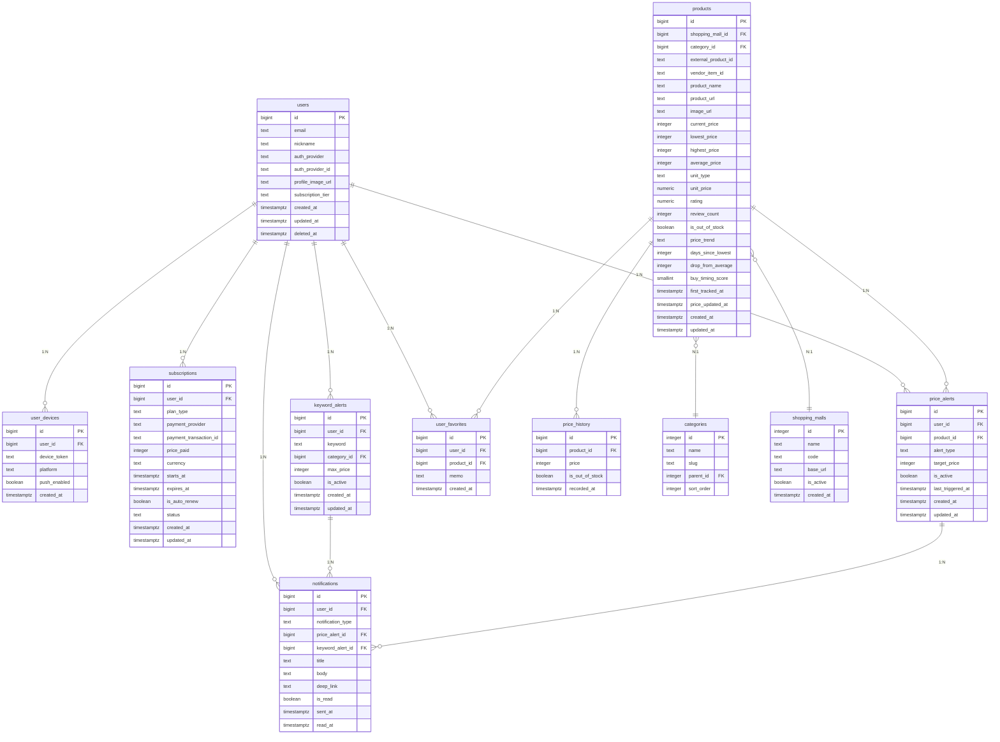

# PullCents DB 스키마 설계 (초안)

> **상태: DRAFT (초안)**
> 작성일: 2026-03-01
> DB: PostgreSQL 17.9 | DB명: pullcents
> **주의: 이 문서는 설계 문서입니다. SQL 코드가 아닙니다. 구현 전 리뷰 필요.**

---

## 목차
1. [ER 다이어그램](#1-er-다이어그램)
2. [테이블별 컬럼 설계](#2-테이블별-컬럼-설계)
3. [인덱스 전략](#3-인덱스-전략)
4. [파티셔닝 고려](#4-파티셔닝-고려)
5. [확장성 노트](#5-확장성-노트)

---

## 1. ER 다이어그램

### 테이블 관계 요약

| 관계 | 설명 |
|---|---|
| users 1:N user_devices | 한 사용자가 여러 디바이스 보유 가능 (폰+태블릿) |
| users 1:N subscriptions | 구독 이력 관리 (갱신 시 새 row) |
| users 1:N price_alerts | 사용자별 여러 알림 설정 |
| users 1:N keyword_alerts | 사용자별 여러 키워드 핫딜 추적 |
| users 1:N user_favorites | 즐겨찾기/관심 상품 |
| users 1:N notifications | 알림 발송 이력 |
| products N:1 categories | 상품은 하나의 카테고리에 속함 |
| products N:1 shopping_malls | 상품은 하나의 쇼핑몰에 속함 |
| products 1:N price_history | 상품별 가격 변동 이력 (시계열) |
| products 1:N price_alerts | 상품별 여러 사용자의 알림 |
| price_alerts / keyword_alerts 1:N notifications | 알림 설정과 발송 이력 연결 |

---

## 2. 테이블별 컬럼 설계

### 2-1. users (사용자)

| 컬럼 | 타입 | 제약조건 | 설명 |
|---|---|---|---|
| id | BIGINT | PK, GENERATED ALWAYS AS IDENTITY | 사용자 고유 ID |
| email | TEXT | UNIQUE, NOT NULL | 이메일 (로그인 식별자) |
| nickname | TEXT | | 표시 이름 |
| auth_provider | TEXT | NOT NULL | 소셜 로그인 제공자 (kakao, google, apple, naver) |
| auth_provider_id | TEXT | NOT NULL | 소셜 로그인 고유 ID |
| profile_image_url | TEXT | | 프로필 이미지 URL |
| subscription_tier | TEXT | NOT NULL, DEFAULT 'free' | 현재 구독 등급 (free, premium) |
| created_at | TIMESTAMPTZ | NOT NULL, DEFAULT NOW() | 가입일시 |
| updated_at | TIMESTAMPTZ | NOT NULL, DEFAULT NOW() | 수정일시 |
| deleted_at | TIMESTAMPTZ | | 탈퇴일시 (soft delete) |

**설계 근거:**
- `auth_provider` + `auth_provider_id` 조합으로 소셜 로그인 식별. 카카오/구글/애플 모두 지원 가능한 구조.
- `subscription_tier`를 users에 비정규화하여 매 요청마다 subscriptions 조인 불필요. 구독 상태 변경 시 같이 업데이트.
- `deleted_at` soft delete 방식으로 탈퇴 후에도 데이터 보존 (법적 의무 기간 대응).

### 2-2. user_devices (사용자 디바이스)

| 컬럼 | 타입 | 제약조건 | 설명 |
|---|---|---|---|
| id | BIGINT | PK, GENERATED ALWAYS AS IDENTITY | 디바이스 고유 ID |
| user_id | BIGINT | FK -> users(id), NOT NULL | 사용자 ID |
| device_token | TEXT | NOT NULL | FCM/APNs 푸시 토큰 |
| platform | TEXT | NOT NULL | 플랫폼 (android, ios, web) |
| push_enabled | BOOLEAN | NOT NULL, DEFAULT TRUE | 푸시 알림 활성화 여부 |
| created_at | TIMESTAMPTZ | NOT NULL, DEFAULT NOW() | 등록일시 |
| updated_at | TIMESTAMPTZ | NOT NULL, DEFAULT NOW() | 갱신일시 |

**설계 근거:**
- 별도 테이블로 분리 — 한 사용자가 Android + iOS + 웹 등 여러 디바이스 사용 가능.
- `device_token`은 FCM(Android/웹) 또는 APNs(iOS) 토큰 저장. 앱 재설치 시 갱신됨.
- `platform` 구분으로 푸시 발송 시 FCM/APNs 라우팅 가능.

### 2-3. products (상품)

| 컬럼 | 타입 | 제약조건 | 설명 |
|---|---|---|---|
| id | BIGINT | PK, GENERATED ALWAYS AS IDENTITY | 내부 상품 ID |
| shopping_mall_id | INTEGER | FK -> shopping_malls(id), NOT NULL | 쇼핑몰 ID |
| category_id | INTEGER | FK -> categories(id) | 카테고리 ID |
| external_product_id | TEXT | NOT NULL | 쇼핑몰 내 상품 ID (쿠팡: productId) |
| vendor_item_id | TEXT | | 판매자 아이템 ID (쿠팡: vendorItemId) |
| product_name | TEXT | NOT NULL | 상품명 |
| product_url | TEXT | | 원본 상품 페이지 URL |
| image_url | TEXT | | 대표 이미지 URL |
| current_price | INTEGER | | 현재 가격 (원) |
| lowest_price | INTEGER | | 역대 최저가 (원) |
| highest_price | INTEGER | | 역대 최고가 (원) |
| average_price | INTEGER | | 평균가 (원) |
| unit_type | TEXT | | 단가 단위 (1정당, 100ml당, 1개당 등) |
| unit_price | NUMERIC(12,2) | | 단가 금액 |
| rating | NUMERIC(2,1) | | 별점 (0.0 ~ 5.0) |
| review_count | INTEGER | DEFAULT 0 | 리뷰 수 |
| is_out_of_stock | BOOLEAN | NOT NULL, DEFAULT FALSE | 현재 품절 여부 |
| price_trend | TEXT | | 가격 추세 (rising, falling, stable) |
| days_since_lowest | INTEGER | | N일만에 최저가 (지니알림 기능) |
| drop_from_average | INTEGER | | 평균가 대비 하락 금액 (지니알림 "N원 싸게 구매하기") |
| buy_timing_score | SMALLINT | | 구매타이밍 점수 0-100 (역대가 가격하락확률 게이지) |
| first_tracked_at | TIMESTAMPTZ | | 최초 가격 추적 시작일 |
| price_updated_at | TIMESTAMPTZ | | 가격 최종 갱신일시 |
| created_at | TIMESTAMPTZ | NOT NULL, DEFAULT NOW() | 레코드 생성일시 |
| updated_at | TIMESTAMPTZ | NOT NULL, DEFAULT NOW() | 레코드 수정일시 |

**설계 근거:**
- `external_product_id` + `vendor_item_id` + `shopping_mall_id`로 각 쇼핑몰 상품 고유 식별. 경쟁사 URL 패턴 분석 결과 세 값 모두 필요 (역대가: `pid={productId}-{vendorItemId}`, 지니알림: `productId` + `vendorItemId` 별도 파라미터).
- 가격 통계 (`lowest_price`, `highest_price`, `average_price`)를 비정규화 — 목록 화면에서 매번 price_history 집계 불필요.
- `unit_type` + `unit_price`: 로우차트/지니알림의 단가 기능 지원 (1정당 금액, 100ml당 등).
- `days_since_lowest`: 지니알림의 "N일만에 최저가" 배지 기능.
- `drop_from_average`: 지니알림의 "N원 싸게 구매하기" CTA 기능.
- `buy_timing_score`: 역대가의 가격하락확률 게이지 (0=절대사지마 ~ 100=지금사야해).
- `price_trend`: 로우차트의 "하락추세" 필터 지원.
- `is_out_of_stock`: 로우차트의 "품절임박" 필터 + 역대가 그래프의 품절 구간 표시 지원.

### 2-4. price_history (가격 변동 이력)

| 컬럼 | 타입 | 제약조건 | 설명 |
|---|---|---|---|
| id | BIGINT | PK, GENERATED ALWAYS AS IDENTITY | 이력 ID |
| product_id | BIGINT | FK -> products(id), NOT NULL | 상품 ID |
| price | INTEGER | NOT NULL | 해당 시점 가격 (원) |
| is_out_of_stock | BOOLEAN | NOT NULL, DEFAULT FALSE | 해당 시점 품절 여부 |
| recorded_at | TIMESTAMPTZ | NOT NULL | 가격 기록 시점 |

**설계 근거:**
- 시계열 데이터의 핵심 테이블. 그래프 렌더링, 통계 집계의 데이터 소스.
- `is_out_of_stock`: 역대가 그래프에서 "판매중(검정선) / 품절(빨간선)" 구간 구분 지원.
- `recorded_at`을 TIMESTAMPTZ로 — 요일별 집계(역대가 요일별 차트), 일별/주별/월별 집계 모두 가능.
- 컬럼을 최소화하여 row 크기 절감 (대용량 테이블이므로).
- 가격 변동이 없으면 기록하지 않는 "변동 시점만 기록" 방식 권장 — 저장 공간 절약.

**요일별 가격 차트 지원 방식:**
- 역대가의 "요일별 최저/최고/평균" 차트는 price_history의 `recorded_at`에서 요일(DOW)을 추출하여 집계.
- 별도 테이블 불필요 — 쿼리 시 `EXTRACT(DOW FROM recorded_at)` 활용.

### 2-5. price_alerts (가격 알림 설정)

| 컬럼 | 타입 | 제약조건 | 설명 |
|---|---|---|---|
| id | BIGINT | PK, GENERATED ALWAYS AS IDENTITY | 알림 설정 ID |
| user_id | BIGINT | FK -> users(id), NOT NULL | 사용자 ID |
| product_id | BIGINT | FK -> products(id), NOT NULL | 상품 ID |
| alert_type | TEXT | NOT NULL | 알림 유형 (아래 참고) |
| target_price | INTEGER | | 지정가 알림 시 목표 가격 (원) |
| is_active | BOOLEAN | NOT NULL, DEFAULT TRUE | 활성화 여부 |
| last_triggered_at | TIMESTAMPTZ | | 마지막 알림 발동 시각 |
| created_at | TIMESTAMPTZ | NOT NULL, DEFAULT NOW() | 생성일시 |
| updated_at | TIMESTAMPTZ | NOT NULL, DEFAULT NOW() | 수정일시 |

**alert_type 값 (4단계, 역대가 참고):**

| 값 | 설명 | 경쟁사 참고 |
|---|---|---|
| `target_price` | 지정가 이하 시 알림 | 역대가 "지정가이하", 로우차트 가격 알림 |
| `below_average` | 평균가 이하 시 알림 | 역대가 "평균가이하" |
| `near_lowest` | 최저가 근접 시 알림 | 역대가 "최저가근접" |
| `all_time_low` | 역대 최저가 갱신 시 알림 | 역대가 "역대최저가" |

**설계 근거:**
- 역대가의 4단계 알림 프리셋을 그대로 지원. 한 상품에 여러 유형의 알림을 동시 설정 가능.
- `target_price`는 `alert_type = 'target_price'`일 때만 사용. 나머지 유형은 products 테이블의 average_price/lowest_price를 기준으로 자동 판단.
- `last_triggered_at`으로 동일 알림 중복 발송 방지 (쿨다운 로직용).

### 2-6. keyword_alerts (키워드 핫딜 추적)

| 컬럼 | 타입 | 제약조건 | 설명 |
|---|---|---|---|
| id | BIGINT | PK, GENERATED ALWAYS AS IDENTITY | 키워드 알림 ID |
| user_id | BIGINT | FK -> users(id), NOT NULL | 사용자 ID |
| keyword | TEXT | NOT NULL | 추적 키워드 (예: "에어팟", "스타벅스") |
| category_id | INTEGER | FK -> categories(id) | 카테고리 한정 (선택) |
| max_price | INTEGER | | 최대 가격 조건 (선택) |
| is_active | BOOLEAN | NOT NULL, DEFAULT TRUE | 활성화 여부 |
| created_at | TIMESTAMPTZ | NOT NULL, DEFAULT NOW() | 생성일시 |
| updated_at | TIMESTAMPTZ | NOT NULL, DEFAULT NOW() | 수정일시 |

**설계 근거:**
- 폴센트의 "키워드 기반 핫딜 추적" 기능 지원.
- `category_id`로 카테고리 한정 가능 — "식품" 카테고리의 "스타벅스"만 추적 등.
- `max_price`로 예산 범위 필터링 — "에어팟 20만원 이하만" 등.
- price_alerts와 별도 테이블로 분리 — 키워드 알림은 특정 상품이 아니라 검색 조건 기반이므로 구조가 다름.

### 2-7. notifications (알림 발송 이력)

| 컬럼 | 타입 | 제약조건 | 설명 |
|---|---|---|---|
| id | BIGINT | PK, GENERATED ALWAYS AS IDENTITY | 알림 ID |
| user_id | BIGINT | FK -> users(id), NOT NULL | 수신 사용자 ID |
| notification_type | TEXT | NOT NULL | 알림 유형 (price_alert, keyword_alert, system, promotion) |
| price_alert_id | BIGINT | FK -> price_alerts(id) | 관련 가격 알림 (해당 시) |
| keyword_alert_id | BIGINT | FK -> keyword_alerts(id) | 관련 키워드 알림 (해당 시) |
| title | TEXT | NOT NULL | 알림 제목 |
| body | TEXT | | 알림 본문 |
| deep_link | TEXT | | 앱 내 이동 경로 (상품 상세 등) |
| is_read | BOOLEAN | NOT NULL, DEFAULT FALSE | 읽음 여부 |
| sent_at | TIMESTAMPTZ | NOT NULL, DEFAULT NOW() | 발송 시각 |
| read_at | TIMESTAMPTZ | | 읽은 시각 |

**설계 근거:**
- 지니알림의 알림센터(벨 아이콘 + 숫자 배지) 기능 지원.
- `notification_type`으로 가격 알림 / 키워드 핫딜 / 시스템 공지 / 프로모션 구분.
- `price_alert_id`, `keyword_alert_id`는 nullable FK — 알림 유형에 따라 하나만 사용.
- `deep_link`로 알림 클릭 시 앱 내 상품 상세 페이지 직행 가능.
- `is_read` + `read_at`으로 읽음 관리 + 안 읽은 알림 수 배지 표시.

### 2-8. subscriptions (유료 구독)

| 컬럼 | 타입 | 제약조건 | 설명 |
|---|---|---|---|
| id | BIGINT | PK, GENERATED ALWAYS AS IDENTITY | 구독 ID |
| user_id | BIGINT | FK -> users(id), NOT NULL | 사용자 ID |
| plan_type | TEXT | NOT NULL | 요금제 (free, monthly, yearly) |
| payment_provider | TEXT | | 결제 수단 (google_play, app_store, stripe) |
| payment_transaction_id | TEXT | | 결제 트랜잭션 ID |
| price_paid | INTEGER | | 결제 금액 (원) |
| currency | TEXT | DEFAULT 'KRW' | 통화 |
| starts_at | TIMESTAMPTZ | NOT NULL | 구독 시작일 |
| expires_at | TIMESTAMPTZ | NOT NULL | 구독 만료일 |
| is_auto_renew | BOOLEAN | NOT NULL, DEFAULT FALSE | 자동 갱신 여부 |
| status | TEXT | NOT NULL, DEFAULT 'active' | 상태 (active, expired, cancelled, refunded) |
| created_at | TIMESTAMPTZ | NOT NULL, DEFAULT NOW() | 생성일시 |
| updated_at | TIMESTAMPTZ | NOT NULL, DEFAULT NOW() | 수정일시 |

**설계 근거:**
- 폴센트가 유일하게 유료 구독(~9,900원/년)을 시도 중. PullCents도 프리미엄 기능 차등 제공 예정.
- `payment_provider`로 Google Play / App Store / Stripe 등 다양한 결제 수단 대응.
- `payment_transaction_id`로 환불/분쟁 시 원본 트랜잭션 추적.
- 갱신 시 새 row 삽입 방식 — 구독 이력 전체 보존.
- `users.subscription_tier`는 현재 활성 구독 캐시 역할 (비정규화).

### 2-9. categories (상품 카테고리)

| 컬럼 | 타입 | 제약조건 | 설명 |
|---|---|---|---|
| id | INTEGER | PK, GENERATED ALWAYS AS IDENTITY | 카테고리 ID |
| name | TEXT | NOT NULL | 카테고리명 (예: "가전/디지털") |
| slug | TEXT | UNIQUE, NOT NULL | URL용 슬러그 (예: "electronics") |
| parent_id | INTEGER | FK -> categories(id) | 상위 카테고리 (NULL이면 최상위) |
| sort_order | INTEGER | NOT NULL, DEFAULT 0 | 표시 순서 |

**설계 근거:**
- 경쟁사 평균 14~18개 카테고리. 역대가 16개, 로우차트 18개+, 지니알림 14개.
- `parent_id` 자기참조로 계층 구조 지원 — 로우차트처럼 "헬스/건강식품 > 비타민/미네랄" 같은 하위 카테고리 트리 가능.
- `slug`로 URL-friendly 식별자 제공 (웹 라우팅용).
- `sort_order`로 프론트엔드 표시 순서 제어.

### 2-10. user_favorites (즐겨찾기)

| 컬럼 | 타입 | 제약조건 | 설명 |
|---|---|---|---|
| id | BIGINT | PK, GENERATED ALWAYS AS IDENTITY | 즐겨찾기 ID |
| user_id | BIGINT | FK -> users(id), NOT NULL | 사용자 ID |
| product_id | BIGINT | FK -> products(id), NOT NULL | 상품 ID |
| memo | TEXT | | 사용자 메모 (선택) |
| created_at | TIMESTAMPTZ | NOT NULL, DEFAULT NOW() | 추가일시 |

**제약조건:** `UNIQUE(user_id, product_id)` — 같은 상품 중복 즐겨찾기 방지.

**설계 근거:**
- 꿀단지의 "원터치 저장" + 전 경쟁사의 관심 상품 기능.
- `memo`로 사용자 개인 메모 추가 가능 ("선물용", "세일 때 구매" 등).

### 2-11. shopping_malls (쇼핑몰)

| 컬럼 | 타입 | 제약조건 | 설명 |
|---|---|---|---|
| id | INTEGER | PK, GENERATED ALWAYS AS IDENTITY | 쇼핑몰 ID |
| name | TEXT | NOT NULL | 쇼핑몰 이름 (쿠팡, 11번가, G마켓 등) |
| code | TEXT | UNIQUE, NOT NULL | 코드 (coupang, 11st, gmarket) |
| base_url | TEXT | NOT NULL | 기본 URL |
| is_active | BOOLEAN | NOT NULL, DEFAULT TRUE | 활성화 여부 |
| created_at | TIMESTAMPTZ | NOT NULL, DEFAULT NOW() | 등록일시 |

**설계 근거:**
- 꿀단지가 다중 쇼핑몰(쿠팡+11번가+G마켓) 지원 — 기존 경쟁사에 없는 차별점.
- 초기에는 쿠팡만 `is_active = TRUE`, 향후 11번가/G마켓/네이버쇼핑 확장 시 row 추가.
- `products.shopping_mall_id`와 연결되어 상품이 어느 쇼핑몰 소속인지 식별.

---

## 3. 인덱스 전략

### 쿼리 패턴별 인덱스 설계

#### 3-1. 상품 조회 관련

| 인덱스 | 대상 테이블 | 컬럼 | 쿼리 패턴 |
|---|---|---|---|
| idx_products_mall_external | products | (shopping_mall_id, external_product_id, vendor_item_id) | 쇼핑몰별 외부 ID로 상품 조회 (크롤링 시 중복 체크) |
| idx_products_category | products | (category_id, current_price) | 카테고리별 상품 목록 + 가격순 정렬 |
| idx_products_trend | products | (price_trend, is_out_of_stock) | 로우차트식 필터 (하락추세/품절임박) |
| idx_products_timing | products | (buy_timing_score) | 역대가식 구매타이밍 상위 상품 조회 |
| idx_products_updated | products | (price_updated_at) | 최근 가격 갱신된 상품 조회 (스케줄러용) |

#### 3-2. 가격 이력 관련

| 인덱스 | 대상 테이블 | 컬럼 | 쿼리 패턴 |
|---|---|---|---|
| idx_price_history_product_time | price_history | (product_id, recorded_at DESC) | 상품별 가격 그래프 시계열 조회 (가장 빈번한 쿼리) |
| idx_price_history_recorded | price_history | (recorded_at) | 시간 범위 기반 조회 (파티셔닝 키 역할, 요일별 집계) |

#### 3-3. 알림 관련

| 인덱스 | 대상 테이블 | 컬럼 | 쿼리 패턴 |
|---|---|---|---|
| idx_price_alerts_product_active | price_alerts | (product_id, is_active) WHERE is_active = TRUE | 가격 변동 시 해당 상품의 활성 알림 조회 (부분 인덱스) |
| idx_price_alerts_user | price_alerts | (user_id, is_active) | 사용자의 알림 목록 조회 |
| idx_keyword_alerts_active | keyword_alerts | (is_active, keyword) WHERE is_active = TRUE | 키워드 매칭 시 활성 키워드 알림 조회 (부분 인덱스) |

#### 3-4. 알림 발송 이력

| 인덱스 | 대상 테이블 | 컬럼 | 쿼리 패턴 |
|---|---|---|---|
| idx_notifications_user_unread | notifications | (user_id, is_read, sent_at DESC) | 사용자의 안 읽은 알림 목록 (알림센터) |
| idx_notifications_sent | notifications | (sent_at) | 시간 범위 기반 알림 이력 조회 |

#### 3-5. 사용자 관련

| 인덱스 | 대상 테이블 | 컬럼 | 쿼리 패턴 |
|---|---|---|---|
| idx_users_auth | users | (auth_provider, auth_provider_id) | 소셜 로그인 시 사용자 조회 |
| idx_user_devices_user | user_devices | (user_id) | 사용자의 디바이스 목록 (푸시 발송) |
| idx_user_devices_token | user_devices | (device_token) | 토큰 기반 디바이스 조회 (토큰 갱신/삭제) |
| idx_user_favorites_user | user_favorites | (user_id, created_at DESC) | 사용자의 즐겨찾기 목록 (최근 추가순) |
| idx_subscriptions_user_active | subscriptions | (user_id, status, expires_at) | 사용자의 현재 활성 구독 조회 |

#### 인덱스 설계 원칙
- **부분 인덱스(Partial Index)** 적극 활용: `WHERE is_active = TRUE` 등으로 인덱스 크기 절감.
- **커버링 인덱스** 고려: 자주 조회되는 컬럼을 인덱스에 포함하여 테이블 접근 최소화.
- price_history는 데이터량이 가장 클 것이므로 인덱스를 최소화하되, 핵심 쿼리(상품별 시계열)는 반드시 인덱스 지원.

---

## 4. 파티셔닝 고려

### 4-1. price_history 파티셔닝 (권장)

**파티셔닝 대상 이유:**
- 가장 빠르게 증가하는 테이블. 예시 산정:
  - 추적 상품 10만 개 x 하루 1회 기록 = 일 10만 rows
  - 연간 약 3,650만 rows
  - 역대가처럼 2022년부터 데이터 보관 시 수억 rows 가능
- 그래프 조회는 대부분 최근 N개월 데이터만 필요.

**파티셔닝 전략: 월별 레인지 파티셔닝**

| 설정 | 값 |
|---|---|
| 파티션 키 | `recorded_at` |
| 파티션 단위 | 월별 (RANGE) |
| 명명 규칙 | `price_history_YYYYMM` (예: price_history_202603) |
| 보관 정책 | 최근 24개월 활성, 이전 데이터 아카이브 or 삭제 |

**장점:**
- 최근 데이터 조회 시 오래된 파티션 스캔하지 않음 (파티션 프루닝).
- 오래된 데이터 삭제/아카이브가 파티션 DROP으로 간단.
- 각 파티션 별도 VACUUM 가능.

**대안 검토:**
- pg_partman 확장으로 파티션 자동 생성/삭제 관리 가능.
- TimescaleDB 확장 사용 시 시계열 최적화 + 자동 파티셔닝 + 압축 가능 (향후 검토).

### 4-2. notifications 파티셔닝 (향후 고려)

- 사용자 수 증가 시 알림 이력도 빠르게 증가.
- 월별 파티셔닝 또는 일정 기간 지난 알림 삭제 정책으로 대응.
- 초기에는 파티셔닝 불필요, 데이터 증가 추이 모니터링 후 결정.

### 4-3. 파티셔닝 제외 테이블

| 테이블 | 이유 |
|---|---|
| users | 사용자 수는 상대적으로 적음 (수십만 ~ 수백만) |
| products | 추적 상품 수는 수십만 수준, 파티셔닝 불필요 |
| price_alerts | 사용자당 수십 개 수준, 데이터량 적음 |
| categories | 수십 rows, 파티셔닝 불필요 |

---

## 5. 확장성 노트

### 5-1. 다중 쇼핑몰 확장 시 변경점

현재 설계는 `shopping_malls` 테이블과 `products.shopping_mall_id` FK로 다중 쇼핑몰을 구조적으로 지원.

**쿠팡 전용 -> 다중 쇼핑몰 전환 시 필요한 작업:**

| 영역 | 현재 (쿠팡 전용) | 변경 필요 사항 |
|---|---|---|
| 상품 식별 | external_product_id + vendor_item_id | 쇼핑몰마다 ID 체계 다름 -> 이미 shopping_mall_id로 분리됨 |
| 가격 크롤링 | 쿠팡 API/크롤러 1개 | 쇼핑몰별 크롤러 추가 (앱 레이어, 스키마 변경 없음) |
| 동일 상품 매핑 | 불필요 | 쇼핑몰 간 동일 상품 매핑 테이블 필요 (product_mappings 추가 검토) |
| 카테고리 | 공통 카테고리 | 쇼핑몰별 카테고리 매핑 테이블 필요 (category_mappings 추가 검토) |
| 알림 | 상품 단위 알림 | 변경 불필요 — 이미 product_id 기반 |
| 가격 비교 | 단일 가격 | 동일 상품의 쇼핑몰간 가격 비교 UI/쿼리 추가 |

**향후 추가 검토 테이블:**
- `product_mappings` — 쇼핑몰 간 동일 상품 매핑 (productA_id <-> productB_id)
- `mall_categories` — 쇼핑몰별 원본 카테고리 -> 공통 카테고리 매핑

### 5-2. 성능 확장 전략

| 단계 | 사용자/상품 규모 | 전략 |
|---|---|---|
| 초기 | 사용자 1만, 상품 1만 | 단일 PostgreSQL, 인덱스 최적화 |
| 성장기 | 사용자 10만, 상품 10만 | price_history 파티셔닝 적용, Read Replica 추가 |
| 확장기 | 사용자 100만, 상품 100만 | 커넥션 풀링(PgBouncer), 캐시 레이어(Redis), 오래된 가격 데이터 압축/아카이브 |

### 5-3. 향후 기능 확장 시 스키마 영향도

| 기능 | 스키마 영향 | 비고 |
|---|---|---|
| AI 가격 예측 | products에 `predicted_lowest_date`, `prediction_confidence` 컬럼 추가 | 예측 모델 결과 캐시 |
| 카드 할인가 (폴센트 기능) | 새 테이블 `card_discounts` (card_name, discount_rate, product_id) | 카드사별 할인 정보 |
| 소셜 기능 (위시리스트 공유) | 새 테이블 `shared_lists` + `shared_list_items` | user_favorites 확장 |
| 이벤트/퀴즈 (폴센트 기능) | 새 테이블 `events`, `event_participations` | 독립 도메인 |
| 인기 검색어 (지니알림 기능) | 새 테이블 `search_logs` -> 집계하여 캐시 | 검색 로그 기반 |
| 유사 상품 추천 | 새 테이블 `product_similarities` (product_id, similar_product_id, score) | 추천 엔진 결과 저장 |

### 5-4. 데이터 보관 정책 (안)

| 테이블 | 보관 기간 | 근거 |
|---|---|---|
| price_history | 전체 보관 (역대가는 2022년부터 보관) | 장기 가격 그래프 + 통계 분석 |
| notifications | 6개월 (읽은 알림은 3개월) | 사용자가 오래된 알림 열람할 일 거의 없음 |
| subscriptions | 영구 보관 | 결제/환불 관련 법적 의무 |
| users (deleted) | 탈퇴 후 1년 | 개인정보보호법 근거 |

---

## 부록: 경쟁사 기능 -> 스키마 매핑 요약

| 경쟁사 기능 | 지원 테이블/컬럼 |
|---|---|
| 역대가: 가격하락확률 게이지 (5단계) | products.buy_timing_score (0-100) |
| 역대가: 요일별 가격 차트 | price_history.recorded_at에서 DOW 추출 집계 |
| 역대가: 4단계 알림 프리셋 | price_alerts.alert_type (target_price, below_average, near_lowest, all_time_low) |
| 역대가: 장기 가격 데이터 | price_history 파티셔닝 + 전체 보관 정책 |
| 지니알림: N일만에 최저가 | products.days_since_lowest |
| 지니알림: N원 싸게 구매하기 | products.drop_from_average |
| 지니알림: 단가 정보 | products.unit_type + products.unit_price |
| 지니알림: 인기 검색어 | 향후 search_logs 테이블 추가 |
| 로우차트: 필터 (품절임박/하락추세) | products.is_out_of_stock + products.price_trend |
| 로우차트: 3일간 하락률 | 앱 레이어에서 price_history 최근 3일 계산 (또는 products에 캐시 컬럼 추가) |
| 로우차트: 단가 계산 | products.unit_type + products.unit_price |
| 로우차트: 4종 정렬 | idx_products_category 인덱스 + 쿼리 ORDER BY |
| 폴센트: 키워드 핫딜 추적 | keyword_alerts 테이블 |
| 폴센트: 유료 구독 | subscriptions 테이블 + users.subscription_tier |
| 꿀단지: 다중 쇼핑몰 | shopping_malls 테이블 + products.shopping_mall_id |

---

> **다음 단계:** 이 초안을 리뷰한 후, 승인되면 SQL DDL 작성 및 마이그레이션 도구 선택 진행.
